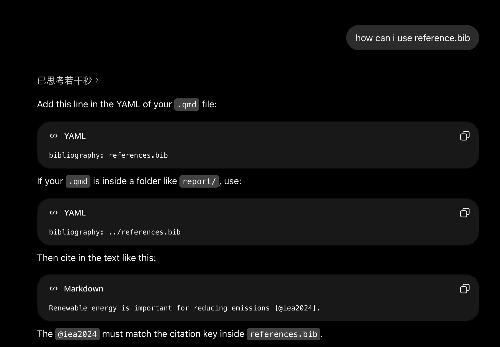
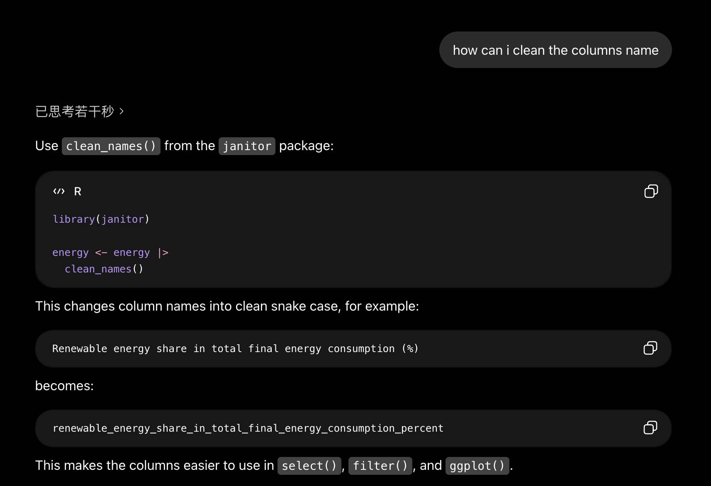
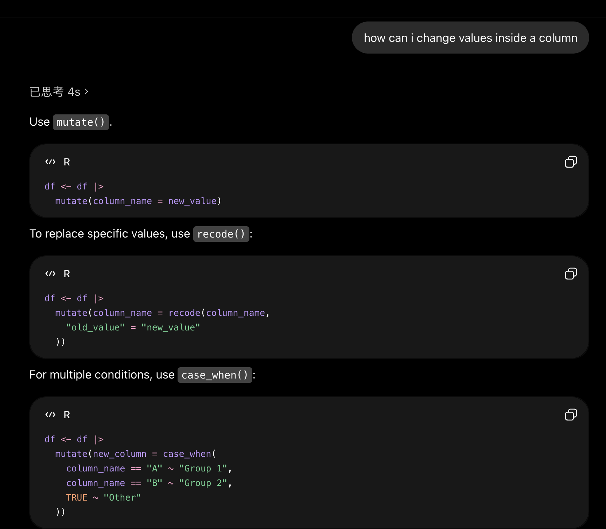
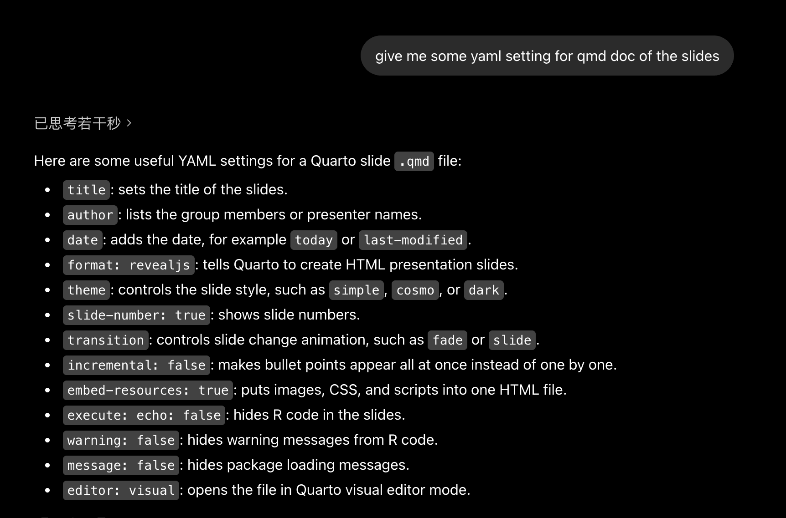

## AI Use Statement
Generative AI tools were used to support this project through wording improvement, code checking, Quarto troubleshooting, Git workflow guidance, and slide structure suggestions. They were also used to help clarify the discussion and recommendations based on the renewable energy and CO2 emissions results.

All analysis decisions, interpretations, and final edits were reviewed by the group members. Generative AI was not used to create or alter data, and the final conclusions were based on the dataset, figures, and results produced in this project.

## Screenshots of AI queries :

