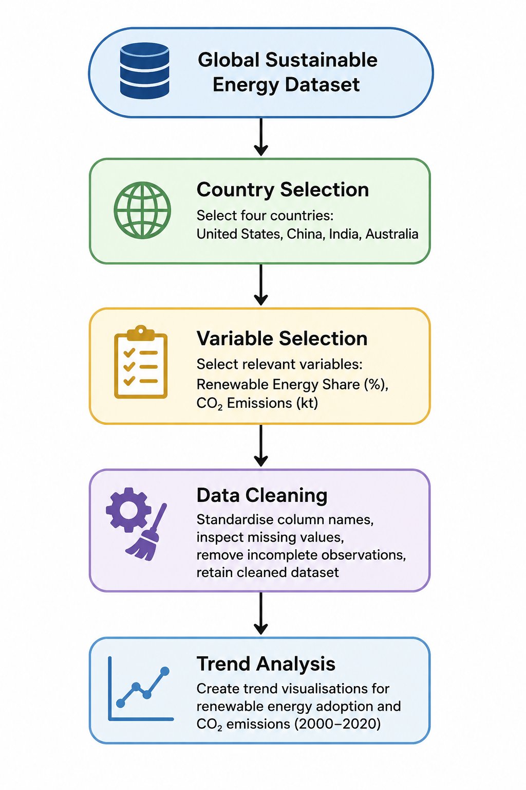

# Executive Summary

This study investigates renewable energy adoption and carbon emission trends in the United States, China, India, and Australia between 2000 and 2020 using data from the Global Sustainable Energy dataset. Through comparative analysis and trend visualisations, the report examines how the transition towards renewable energy has progressed across these major economies and whether these changes have been accompanied by shifts in carbon emission levels.

The results suggest that increasing renewable energy use does not automatically lead to lower carbon emissions. While all four countries expanded their use of renewable energy over the study period, the outcomes varied considerably. In China and India, carbon emissions continued to rise despite substantial growth in renewable energy adoption, reflecting the combined effects of rapid economic expansion, growing populations, and increasing energy demand. These findings highlight the importance of complementing renewable energy investments with broader strategies aimed at reducing overall reliance on fossil fuels.


# Introduction

The transition towards renewable energy has become an important strategy for addressing climate change and reducing greenhouse gas emissions [@iea2024]. This study examines renewable energy adoption and carbon emission trends across major economies between 2000 and 2020. As concerns about climate change continue to grow, many countries have increased investment in renewable energy sources such as wind, solar, and hydropower to reduce reliance on fossil fuels. Understanding whether greater renewable energy adoption is associated with lower carbon emissions can provide valuable insights for energy and environmental policy.

The analysis uses a global sustainable energy dataset covering 176 countries over the period 2000–2020. Key variables include renewable energy share in total energy consumption, electricity generation from renewable and fossil fuel sources, low-carbon electricity production, carbon dioxide (CO₂) emissions, and GDP per capita. The research question guiding this study is: *How have renewable energy adoption levels and carbon emissions changed among major economies between 2000 and 2020?* By comparing trends over time, this study aims to explore the relationship between renewable energy growth and carbon emissions and identify differences in energy transition patterns across countries.


# Methodology

The variables selected for the analysis are summarised in @tbl-vars.

| Variable | Type | Purpose |
|-----------|-----------|-----------|
| Renewable energy share in total final energy consumption (%) | Percentage (%) | Measures renewable energy adoption |
| CO₂ emissions | Kilotonnes (kt) | Measures carbon emission levels |

Table: Key variables used in the analysis. {#tbl-vars}

The analytical workflow used in this study is illustrated in @fig-workflow.

```{r}
#| label: fig-workflow
#| fig-cap: "Data preparation and analysis workflow."
#| echo: false


```

The Global Sustainable Energy dataset was used for this analysis. The dataset contains energy and environmental indicators for 176 countries between 2000 and 2020. Four countries were selected for comparison: the United States, China, India and Australia. These countries were chosen because they represent major economies with differing patterns of energy consumption and renewable energy adoption.

The analysis focused on renewable energy share in total final energy consumption as an indicator of renewable energy adoption and carbon dioxide (CO₂) emissions as an indicator of environmental impact. Data were imported into R and cleaned using the `tidyverse` and `janitor` packages. Column names were standardised and only variables relevant to the research question were retained. Missing values were inspected and observations with incomplete data were excluded where necessary. Since selected variables contained missing observations for 2020, the most recent complete observations available in 2019 were used for summary comparisons.

Comparative trend analysis was performed using visualisations created with `ggplot2`. Renewable energy adoption and CO₂ emission trends were examined across the selected countries between 2000 and 2020. Additional comparative visualisations were created to explore differences in renewable energy adoption and emission levels among the selected economies.

# Results
@fig-co2-trend shows that carbon dioxide emissions in these four economies changed significantly between 2000 and 2020. China saw the most rapid growth, with emissions rising from approximately 3.3 million kt to over 10 million kt. The United States, meanwhile, showed a gradual decline, falling from about 5.9 million metric tons to 4.8 million metric tons. India’s emissions grew steadily, while Australia’s remained at a relatively low and stable level.

```{r}
#| label: fig-co2-trend
#| fig-cap: "CO₂ Emissions Trends in Selected Economies (2000–2020)"
#| echo: false
knitr::include_graphics(here::here("Figures/co2_trend.png"))
```

Data from @fig-renewable-trend shows that India consistently had the highest share of renewable energy throughout the study period, though this share declined from 47% in 2000 to 33% in 2019. China’s share of renewable energy initially fell sharply but then rebounded slightly, while Australia and the United States saw a modest increase to around 10%.
```{r}
#| label: fig-renewable-trend
#| fig-cap: "Renewable Energy Adoption Trends in Selected Economies (2000–2020)"
#| echo: false
knitr::include_graphics(here::here("Figures/renewable_trend.png"))
```

As shown in Figures @fig-scatter and @fig-facet, the increase in the share of renewable energy in 2019 did not always correspond to a reduction in emissions, suggesting that economic scale has a greater impact on a country’s emission levels than the adoption of renewable energy.

```{r}
#| label: fig-scatter
#| fig-cap: "Relationship Between Renewable Energy Share and CO₂ Emissions by Country in 2019"
#| echo: false
knitr::include_graphics(here::here("Figures/scatter_2019.png"))
```

```{r}
#| label: fig-facet
#| fig-cap: "CO₂ Emissions and Renewable Energy Share by Country in 2019"
#| echo: false
knitr::include_graphics(here::here("Figures/facet_2019.png"))
```


# Discussion and Recommendations

## Discussion

The results show that the share of renewable energy and carbon emissions do not always move in the same direction. As shown in @fig-renewable-trend, India had the highest share of renewable energy in 2019, but @fig-co2-trend shows that its CO2 emissions continued to rise during the study period. China’s share of renewable energy rebounded after 2012, yet it remained the country with the highest CO2 emissions among the four. In contrast, CO2 emissions in the United States declined overall, while Australia’s emissions were lower and relatively stable.

The 2019 comparison in @fig-facet and @fig-scatter also supports this pattern. India had the highest renewable energy share, but China had the highest CO2 emissions. Australia and the United States had similar renewable energy shares in 2019, but their CO2 emission levels were very different. This indicates that carbon emissions are not solely influenced by the share of renewable energy. The comparison suggests that factors such as economic scale, industrial activity, and overall energy demand may have a substantial influence on emission levels alongside renewable energy adoption.

A country’s size, population, industrial activity, economic growth, and reliance on fossil fuels all affect total emissions. For example, China and India have large populations and high energy demand, so emissions may continue to rise even as renewable energy use increases. The situations in the United States and Australia also demonstrate that a country’s energy mix and economic scale influence emission trends.


## Recommendations
Based on these findings, major economies should continue to invest in renewable energy infrastructure, such as solar, wind, and hydroelectric power. Governments should also improve grid infrastructure and energy storage systems to enable the more stable and widespread use of renewable energy [@un2024].

Finally, renewable energy policies should be integrated with broader low-carbon policies, particularly in high-emission sectors such as power generation, transportation, and heavy industry. This is because simply increasing the use of renewable energy may not be sufficient to significantly reduce total CO2 emissions [@worldbank2024].


## Conclusion
Overall, this study suggests that higher renewable energy adoption does not always result in lower carbon emissions. The comparison of China, India, the United States, and Australia shows that emission trends are shaped by each country’s wider economic and energy context.

Factors such as total energy demand, fossil fuel dependence, population size, and industrial activity also play an important role. Therefore, renewable energy share should not be considered on its own. A more complete understanding of carbon emissions requires looking at both renewable energy adoption and the broader conditions behind each country’s energy system.

# References
