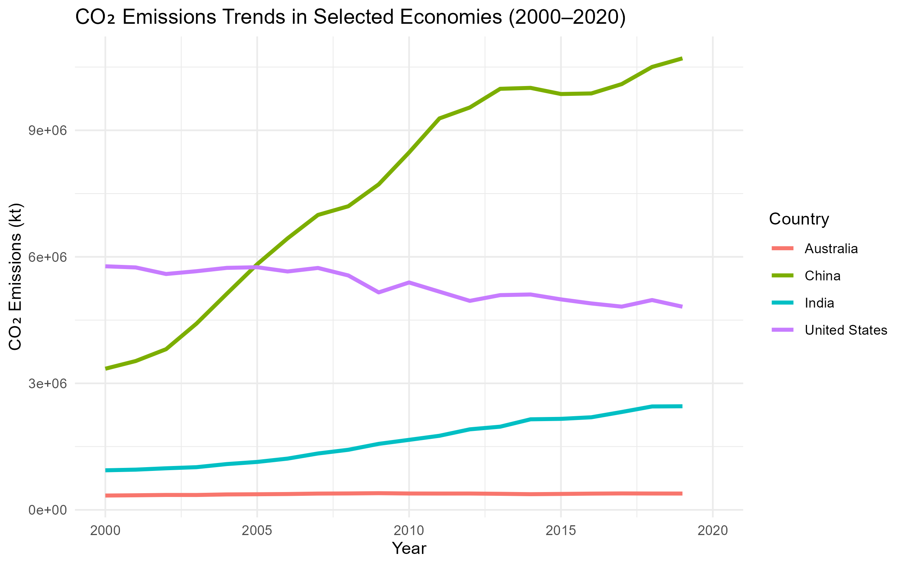
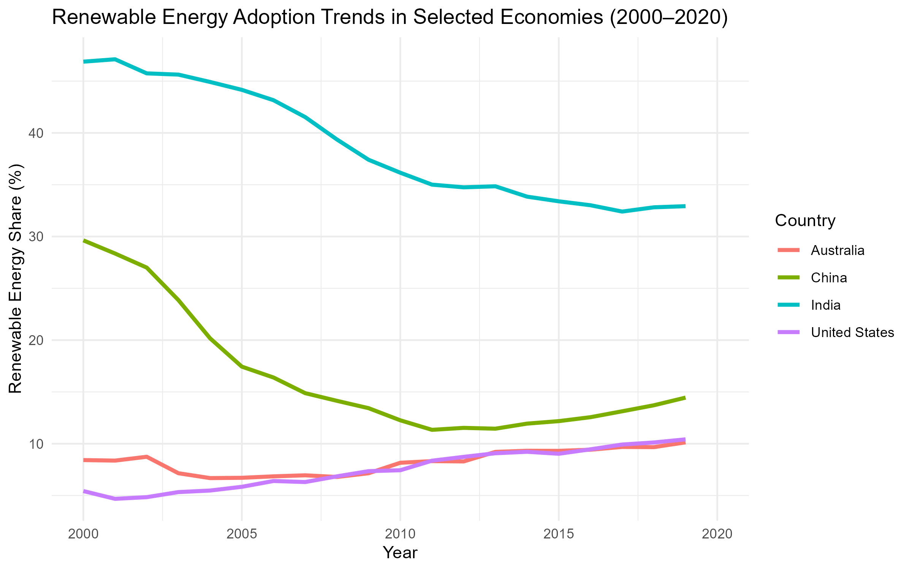
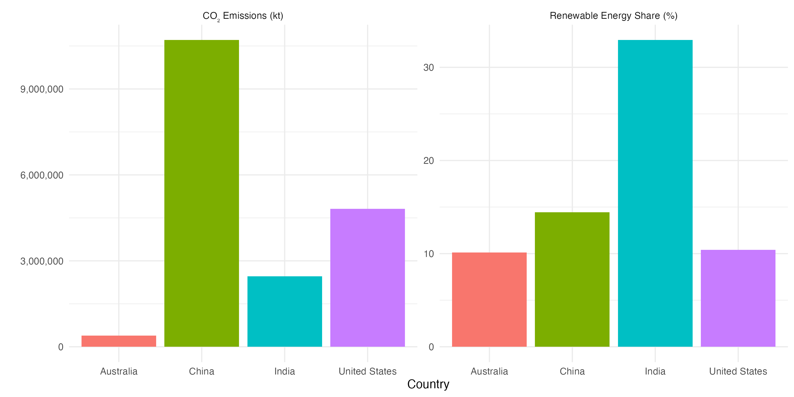

## Problem Introduction {.smaller}

- Topic: renewable energy adoption and CO2 emissions
- Period: 2000–2020
- Countries: China, India, United States, Australia

::: fragment
**Research question:**  
How did renewable energy adoption and carbon emissions change across these major economies?
:::

---

## Dataset Description {.smaller}

- Source: Global Sustainable Energy dataset
- Coverage: 176 countries from 2000 to 2020
- Focus: four selected major economies
- Key variables:
  - Renewable energy share (%)
  - CO2 emissions (kt)

---

## Methodology {.smaller}

- Cleaned and prepared the dataset in R
- Standardised column names
- Filtered the four selected countries
- Selected renewable energy and CO2 emission variables
- Used 2019 for comparison due to missing 2020 observations
- Created trend and comparison visualisations using `ggplot2`
:::

```{r}
# CODE FRAMEWORK ONLY
# This section shows where the data preparation code should go.

# Load packages
# library(tidyverse)

# Load cleaned data
# energy_analysis <- read_csv("../Data/energy_analysis.csv")

# Check variable names
# names(energy_analysis)

# Filter selected countries if needed
# energy_analysis <- energy_analysis |>
#   filter(entity %in% c("China", "India", "United States", "Australia"))
```

---

## Results: CO₂ Emissions Trend {.smaller}

{fig-align="center"}

- China had the highest CO₂ emissions
- India’s emissions increased over time
- United States emissions declined overall
- Australia remained low and stable

---

## Results: Renewable Energy Trend {.smaller}

{fig-align="center"}

- India had the highest renewable energy share
- China declined first, then recovered slightly after 2012
- Australia and the United States increased slowly

---

## Results: 2019 Comparison {.smaller}

{fig-align="center"}

- India had the highest renewable energy share
- China had the highest CO2 emissions
- Renewable energy share alone did not explain emissions

---

## Discussion {.smaller}

- Renewable energy and CO2 emissions did not always move together
- Higher renewable share did not automatically mean lower emissions
- Emissions were also affected by:
  - population size
  - industrial activity
  - economic scale
  - energy demand
  - fossil fuel dependence


---

## Recommendations {.smaller}

- Continue investing in renewable energy infrastructure
- Improve grid infrastructure and energy storage
- Combine renewable energy policies with low-carbon policies
- Focus on high-emission sectors:
  - power generation
  - transport
  - heavy industry


---

## Conclusion {.smaller}

- Renewable energy adoption is important
- But it does not explain emissions by itself
- Each country has a different energy and economic context
- A complete analysis should consider renewable energy, fossil fuel use, energy demand, and national differences